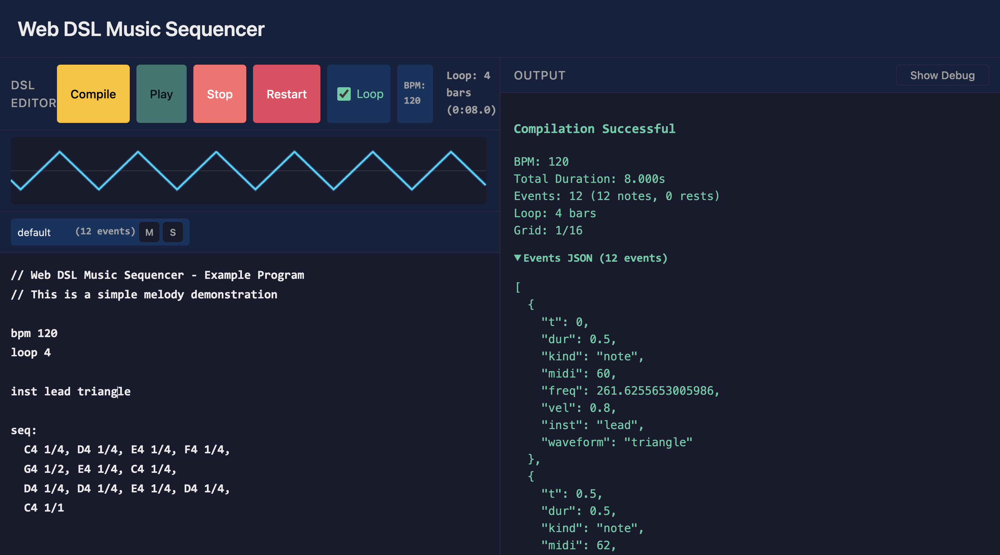

# Web DSL Music Sequencer

A browser-based music sequencer that uses a custom Domain-Specific Language (DSL) to define musical sequences. Write music using a simple text-based syntax and hear it play back using the Web Audio API.



## Features

### Core Features
- **Custom DSL**: Define musical sequences with a simple, readable syntax
- **Real-time Playback**: Hear your compositions using Web Audio API
- **Live Editor**: Write and edit DSL code in-browser
- **Instant Feedback**: See compilation results and errors immediately

### v0.2 Features
- **Multiple Tracks**: Layer different instruments playing simultaneously
- **Reusable Patterns**: Define patterns once, use them multiple times
- **Chords**: Play multiple notes at the same time with bracket notation
- **Repeat Blocks**: Efficiently repeat sections with `xN { ... }` syntax
- **Swing Timing**: Add groove with configurable swing amount
- **Loop Control**: Set loop length in bars for continuous playback
- **Per-Note Velocity**: Control dynamics with individual note velocities
- **Extended Instruments**: Customize gain and ADSR envelope per instrument
- **Transport Controls**: Play, Stop, Restart with loop toggle
- **Track Mute/Solo**: Focus on specific tracks during playback
- **Debug Panel**: Inspect compiled AST and events

## Getting Started

### Prerequisites

- Node.js (v18 or higher recommended)
- npm

### Installation

```bash
# Clone the repository
git clone <repository-url>
cd web-sequencer

# Install dependencies
npm install
```

### Development

```bash
# Start the development server
npm run dev
```

The application will be available at `http://localhost:5173`

### Testing

```bash
# Run tests
npm test

# Run tests in watch mode
npm test -- --watch
```

### Building for Production

```bash
# Build the project
npm run build

# Preview the production build
npm run preview
```

## Project Structure

```
src/
├── dsl/           # DSL tokenizer, parser, compiler
│   └── __tests__/ # Unit tests for DSL modules
├── audio/         # Web Audio engine
└── ui/            # UI components
```

## DSL Syntax

The DSL (Domain-Specific Language) allows you to define musical sequences using a simple text-based syntax.

### Basic Structure

A DSL program consists of three main parts:

1. **BPM directive** - Sets the tempo (beats per minute)
2. **Instrument directive** - Defines the instrument and waveform
3. **Sequence block** - Contains the notes to play

### Example Program

```
// A simple melody
bpm 120

inst lead sine

seq:
  C4 1/4, D4 1/4, E4 1/4, F4 1/4,
  G4 1/2, E4 1/4, C4 1/4,
  D4 1/4, D4 1/4, E4 1/4, D4 1/4,
  C4 1/1
```

### Directives

#### BPM (Beats Per Minute)
```
bpm <number>
```
Sets the tempo. Default is 120 if not specified.

Examples:
- `bpm 120` - Standard tempo
- `bpm 60` - Slow tempo
- `bpm 180` - Fast tempo

#### Instrument
```
inst <name> <waveform>
```
Defines the instrument. Default is `lead sine` if not specified.

**Waveforms:**
- `sine` - Smooth, pure tone
- `square` - Harsh, buzzy tone
- `sawtooth` - Bright, rich tone
- `triangle` - Soft, hollow tone

Examples:
- `inst lead sine`
- `inst bass square`
- `inst synth sawtooth`

### Sequence Block

```
seq:
  <note> <duration>, <note> <duration>, ...
```

The sequence block contains a comma-separated list of notes with their durations.

#### Notes

Notes are specified as: `<pitch><octave>`

**Pitch names:** C, D, E, F, G, A, B (case-insensitive)

**Accidentals:**
- `#` - Sharp (raises pitch by one semitone)
- `b` - Flat (lowers pitch by one semitone)

**Octaves:** 0-9 (Middle C is C4)

Examples:
- `C4` - Middle C
- `A4` - A above middle C (440 Hz)
- `C#4` - C sharp
- `Bb3` - B flat

#### Rests

Use `r` for a rest (silence):
```
seq: C4 1/4, r 1/4, E4 1/4, r 1/4
```

#### Durations

Durations are specified as fractions: `<numerator>/<denominator>`

Common durations:
- `1/1` - Whole note (4 beats)
- `1/2` - Half note (2 beats)
- `1/4` - Quarter note (1 beat)
- `1/8` - Eighth note (1/2 beat)
- `1/16` - Sixteenth note (1/4 beat)
- `3/8` - Dotted quarter (1.5 beats)

### Comments

Use `//` for single-line comments:
```
// This is a comment
bpm 120  // Tempo setting
```

### Complete Example

```
// Bass line with rests
bpm 100

inst bass square

seq:
  C2 1/8, r 1/8, C2 1/8, r 1/8,
  E2 1/8, r 1/8, G2 1/8, r 1/8,
  C3 1/2
```

---

## v0.2 DSL Extensions

Version 0.2 introduces powerful new features for creating more complex compositions.

### Global Settings

#### Swing
```
swing <0..0.75>
```
Applies swing timing to off-beat notes. Higher values create more shuffle/groove.

- `swing 0` - No swing (straight timing, default)
- `swing 0.5` - Medium swing
- `swing 0.75` - Maximum swing

#### Loop
```
loop <bars>
```
Sets the loop length in bars. Playback will loop for this duration.

- `loop 1` - Loop for 1 bar (default)
- `loop 4` - Loop for 4 bars
- `loop 8` - Loop for 8 bars

#### Grid
```
grid <denominator>
```
Sets the grid resolution for step quantization.

- `grid 16` - 16th note grid (default)
- `grid 8` - 8th note grid
- `grid 32` - 32nd note grid

### Extended Instrument Definition

```
inst <name> <waveform> [gain=<0..1>] [attack=<s>] [decay=<s>] [sustain=<0..1>] [release=<s>]
```

Define instruments with custom ADSR envelope and gain settings.

**Parameters:**
- `gain` - Volume level (0-1, default: 0.5)
- `attack` - Attack time in seconds (default: 0.005)
- `decay` - Decay time in seconds (default: 0.05)
- `sustain` - Sustain level (0-1, default: 0.7)
- `release` - Release time in seconds (default: 0.08)

**Examples:**
```
inst lead sine gain=0.8
inst bass square gain=0.6 attack=0.01 release=0.1
inst pad triangle attack=0.5 decay=0.2 sustain=0.8 release=0.5
```

### Tracks

Tracks allow multiple instruments to play simultaneously.

```
track <trackName> inst=<instName>:
  <notes...>
```

**Example:**
```
inst lead sine
inst bass square

track melody inst=lead:
  C4 1/4, E4 1/4, G4 1/2

track bassline inst=bass:
  C2 1/2, G2 1/2
```

Both tracks play at the same time, creating layered arrangements.

### Patterns

Patterns are reusable sequences that can be referenced multiple times.

#### Defining a Pattern
```
pattern <patternName>:
  <notes...>
```

#### Using a Pattern
```
use <patternName>
use <patternName> xN   // Repeat pattern N times
```

**Example:**
```
pattern riff:
  C4 1/8, E4 1/8, G4 1/8, E4 1/8

track melody inst=lead:
  use riff x4   // Plays the riff 4 times
```

### Chords

Play multiple notes simultaneously using bracket notation.

```
[<note1> <note2> ...] <duration>
```

**Example:**
```
seq:
  [C4 E4 G4] 1/2,      // C major chord
  [D4 F4 A4] 1/2,      // D minor chord
  [G3 B3 D4 F4] 1/1    // G7 chord
```

Each note in the chord becomes a separate event at the same start time.

### Repeat Blocks

Repeat a section of notes multiple times.

```
xN { <notes...> }
```

**Example:**
```
seq:
  x4 { C4 1/8, E4 1/8 },  // Repeats C-E pattern 4 times
  G4 1/2
```

Repeat blocks can be nested:
```
seq:
  x2 {
    x4 { C4 1/16 },
    D4 1/4
  }
```

### Per-Note Velocity

Control the volume of individual notes.

```
<note> <duration> vel=<0..1>
```

**Example:**
```
seq:
  C4 1/4 vel=1.0,    // Loud
  D4 1/4 vel=0.5,    // Medium
  E4 1/4 vel=0.3,    // Soft
  F4 1/4 vel=0.8
```

Default velocity is 0.8 if not specified.

---

## v0.2 Complete Example

Here's a complete example showcasing v0.2 features:

```
// Multi-track composition with patterns
bpm 120
loop 4
swing 0.3

// Define instruments with custom settings
inst lead sine gain=0.7 attack=0.01 release=0.1
inst bass square gain=0.5
inst pad triangle attack=0.3 sustain=0.6 release=0.3

// Define reusable patterns
pattern melody_a:
  C4 1/8, E4 1/8, G4 1/4, E4 1/8, C4 1/8

pattern bass_groove:
  C2 1/8 vel=1.0, r 1/8, C2 1/8 vel=0.6, r 1/8

// Melody track
track melody inst=lead:
  use melody_a x2,
  [C4 E4 G4] 1/2,
  x2 { D4 1/8, F4 1/8 },
  C4 1/2

// Bass track
track bass inst=bass:
  use bass_groove x4

// Pad track with chords
track chords inst=pad:
  [C3 E3 G3] 1/1,
  [F3 A3 C4] 1/1,
  [G3 B3 D4] 1/1,
  [C3 E3 G3] 1/1
```

---

## Transport Controls

The application provides enhanced transport controls:

- **Play**: Compiles and starts playback
- **Stop**: Immediately stops all sounds
- **Restart**: Resets playhead to beginning and continues playing
- **Loop Toggle**: Enable/disable looping (defaults to on if `loop` is set)
- **BPM Display**: Shows the tempo from your DSL program

### Track Mute and Solo

When multiple tracks are present, each track shows Mute (M) and Solo (S) buttons:

- **Mute (M)**: Silences the track - its events won't be scheduled
- **Solo (S)**: Only soloed tracks play - all others are muted
- Multiple tracks can be soloed simultaneously
- When no tracks are soloed, mute settings apply normally

### Debug Panel

Click "Show Debug" to inspect:
- **Compiled AST**: View global settings (BPM, loop, swing, grid)
- **Events**: See all compiled events with track, timing, pitch, and velocity data
- Chord notes appear as multiple events at the same time

## License

MIT
